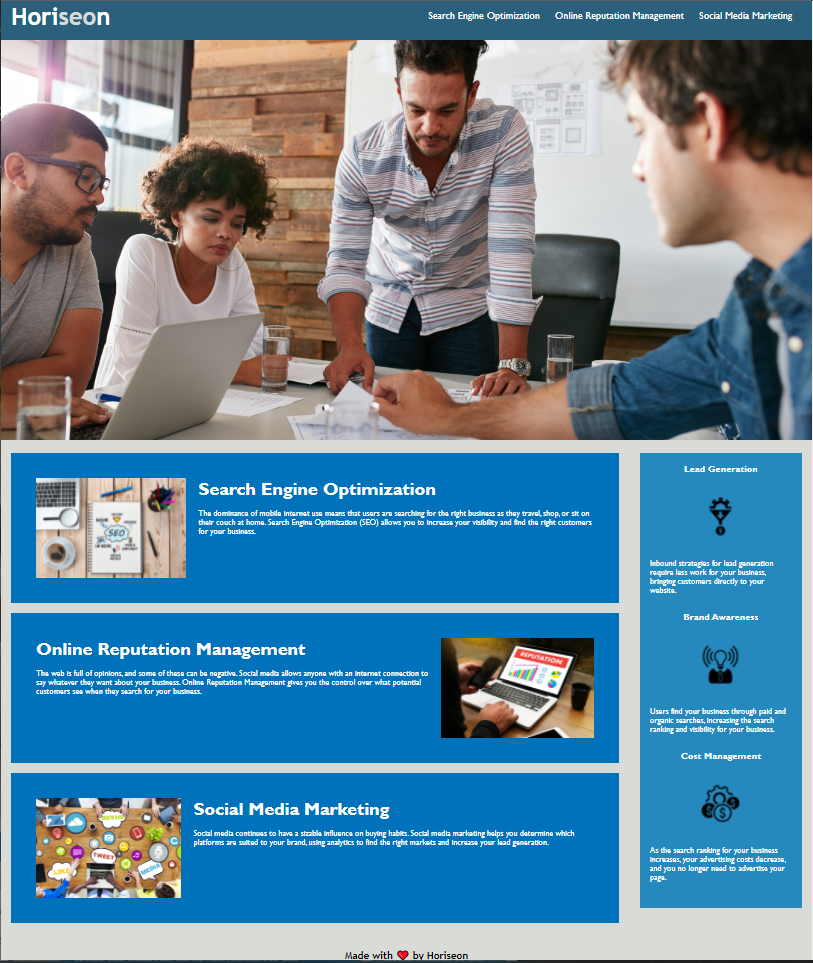

# Horiseon Challenge README
Github Deployed Link: [Horiseon]

The purpose of this project was to edit and simplify the HTML and CSS files of an existing, fully functional website. We were challenged with project management, having to clean up someone else's code. Some issues that were encountered with the code were spacing issues, incorrect class labeling, as well as ignoring HTML semantics. What need more TLC was the stylesheet. Classes were merged to avoid duplication, others were renamed, smooth scroll behavior was added to enhance the user experience and an aside was added to both the stylesheet and index. Comments were also added on both files for clarification.

[Horiseon]: https://n7-gil.github.io/Horiseon-Challenge/

